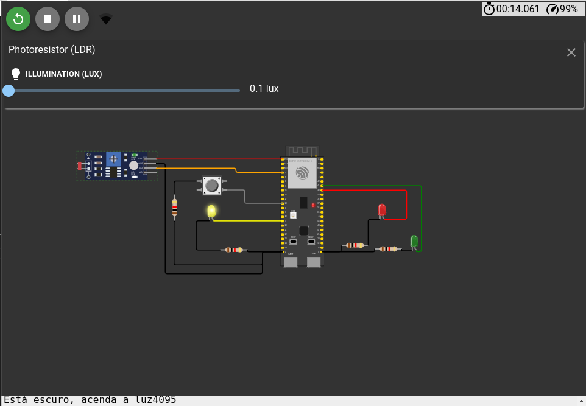

# Funcionamento

### Estado normal:
O estado normal, ativado durante o dia, ou seja, quanto a luminosidade está maior ou igual a 600, representa o funcionamento normal de um semáforo. Ele acende o vermelho por 5 segundos, depois o verde por 3 segundo e, em seguida, o amarelo por 2 segundos. E repete isso. 

----- 
### Estado Noturno:
O estado noturno é ativo durante a noite, ou seja, quando a luminosidade está menor do que 600. Assim, apenas o led amarelo fica piscando.

-----

### Botão de Pedestre:
Se o semáforo estiver em estado normal, ao pressionar o botão, o LED vermelho acende após 1 segundo. Em seguida, volta-se ao funcionamento normal, ou seja, ele apagará depois de 5 segundos e assim por diante.

